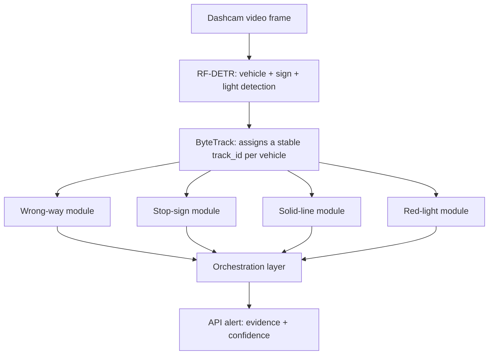
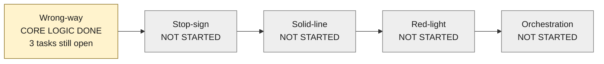
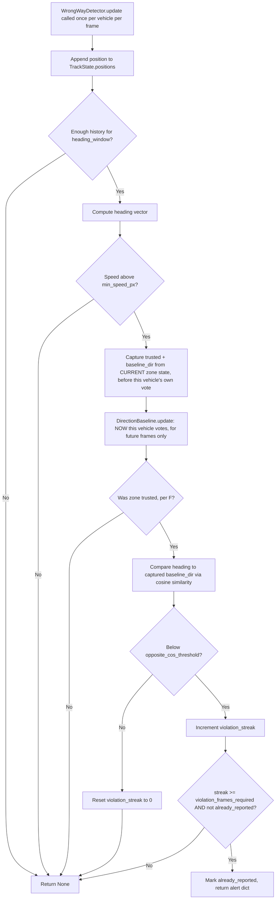

# Architecture diagrams

These diagrams use Mermaid syntax — plain text that Claude Code can parse
directly as structure (nodes and edges), and that also renders visually in
GitHub, VS Code preview, and most markdown viewers. This file is a
companion to `../CLAUDE.md`, not a replacement — read that first for the
full task lists and design principles.

## 1. Data flow

How a single frame moves through the system, from camera to API alert.

Key point encoded in this diagram: detection and tracking (B, C) run once
per frame and feed all four modules in parallel — never duplicate the
RF-DETR/ByteTrack call inside a module.

## 2. Module build order and current status

This is a **suggested build order, not a hard dependency** — each module's
code is independent (see `../CLAUDE.md` principle 5). The order reflects
implementation difficulty (wrong-way is self-calibrating and vision-only;
red-light needs a secondary color classifier and light-to-lane
association) and the fact that the orchestration layer has nothing to do
until at least two modules exist. If Claude Code is asked to work on a
later module before an earlier one is finished, that's fine — the ordering
is a recommendation, not a blocker.

## 3. Wrong-way module internals

The one module that's actually built — useful as a concrete reference
before implementing the others, since they follow the same shape
(config -> per-frame update -> state machine -> alert).

